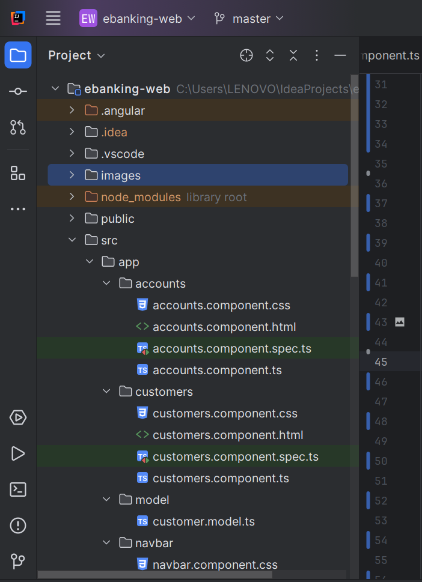
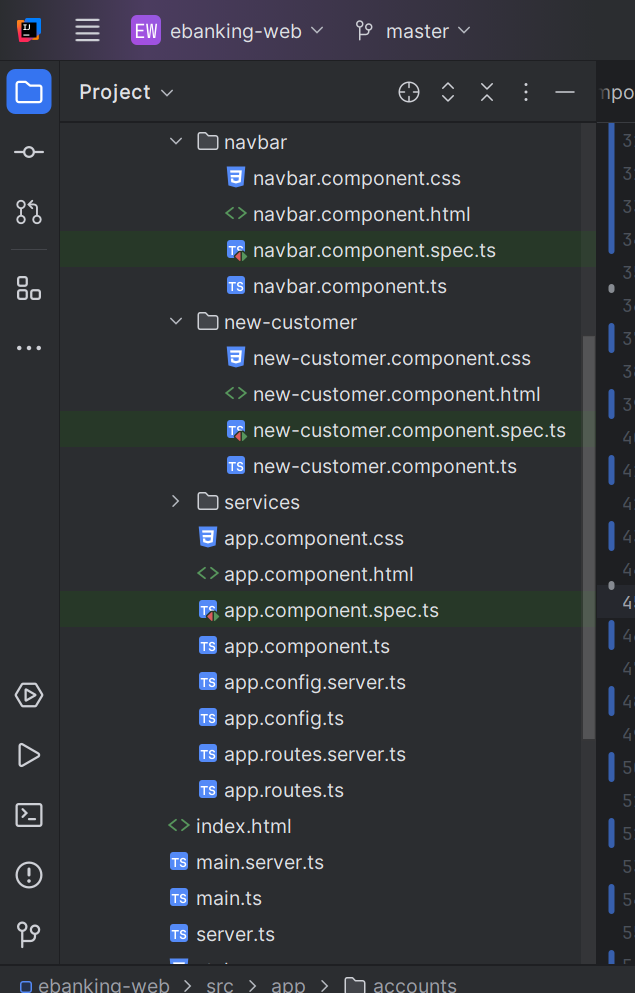
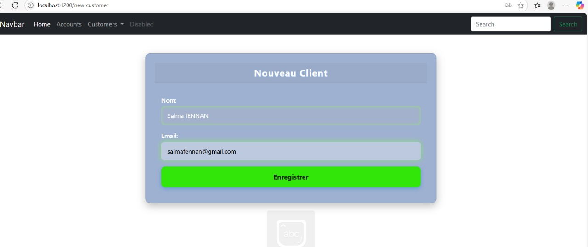
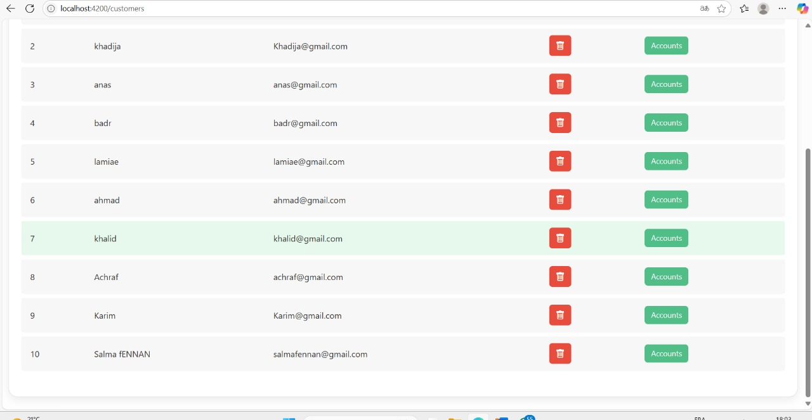
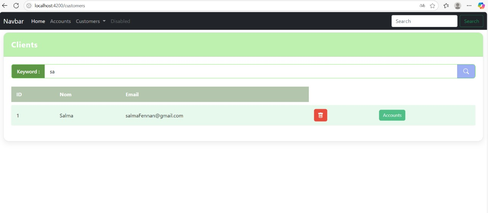
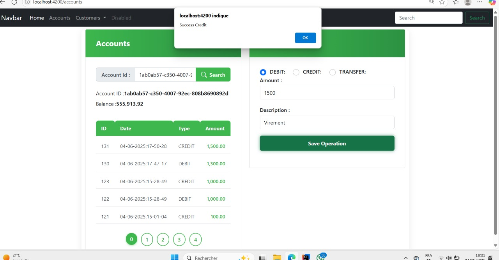
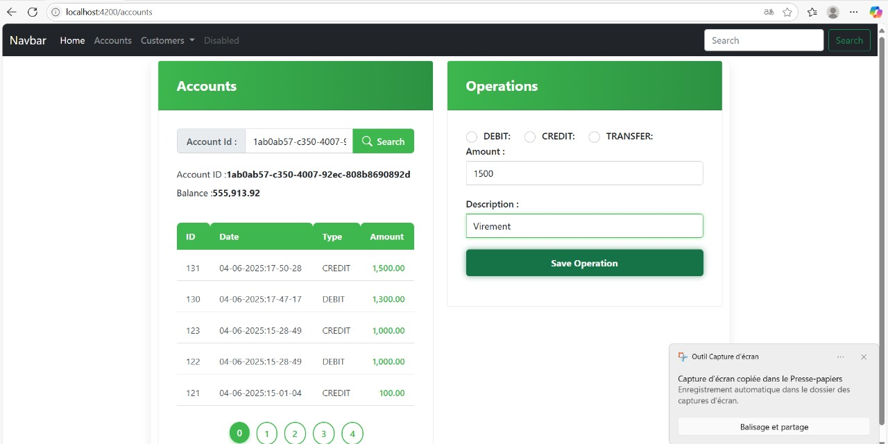
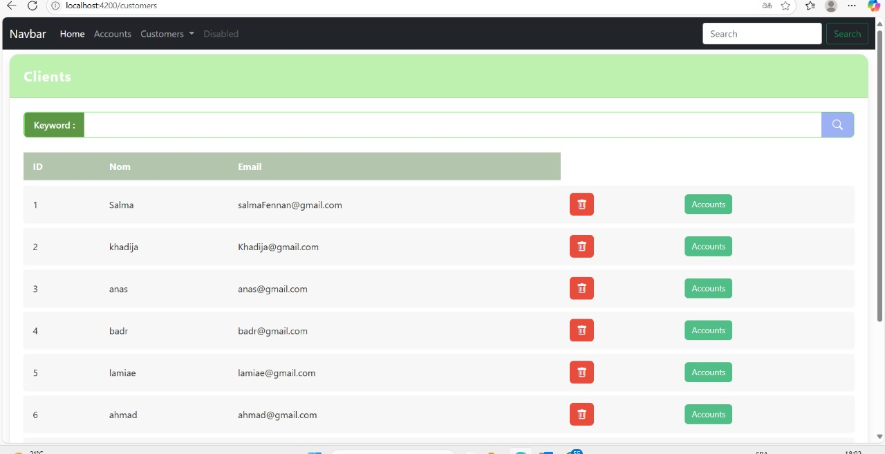
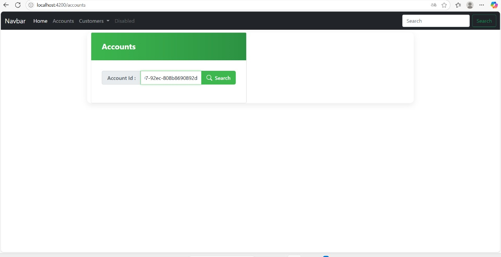

# EbankingWebFrontend - Gestion de Comptes Bancaires (Angular)

# Description du projet

Cette partie frontend de l'application permet de gérer les comptes bancaires et les clients à travers une interface utilisateur intuitive. 
Elle utilise Angular pour consommer les API REST fournies par le backend Spring Boot.

# Fonctionnalités principales

**Gestion des customers :** création, modification, suppression, recherche.

**Gestion des comptes bancaires :** ajout, consultation, mise à jour, suppression.

## Prérequis

Node.js (version 18 ou supérieure)

Angular CLI

Backend en cours d'exécution (port 8085)

Installation d'Angular CLI

npm install -g @angular/cli

## Installez les dépendances :

npm install

Lancement de l'application

Lancez l'application en mode développement :

ng serve

Accédez à l'interface sur :

http://localhost:4200

## Structure du projet

## Technologies utilisées

Angular 16

TypeScript

Tailwind CSS

JWT pour l'authentification

## Interfaces

## Auteur

FENNAN Salma
